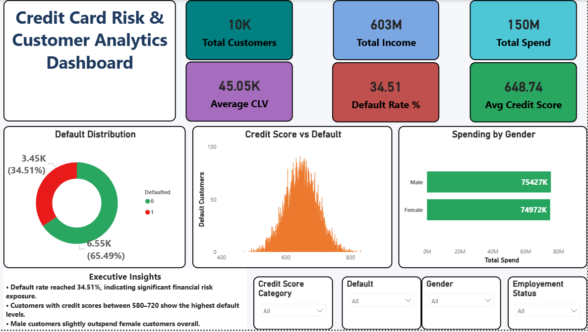
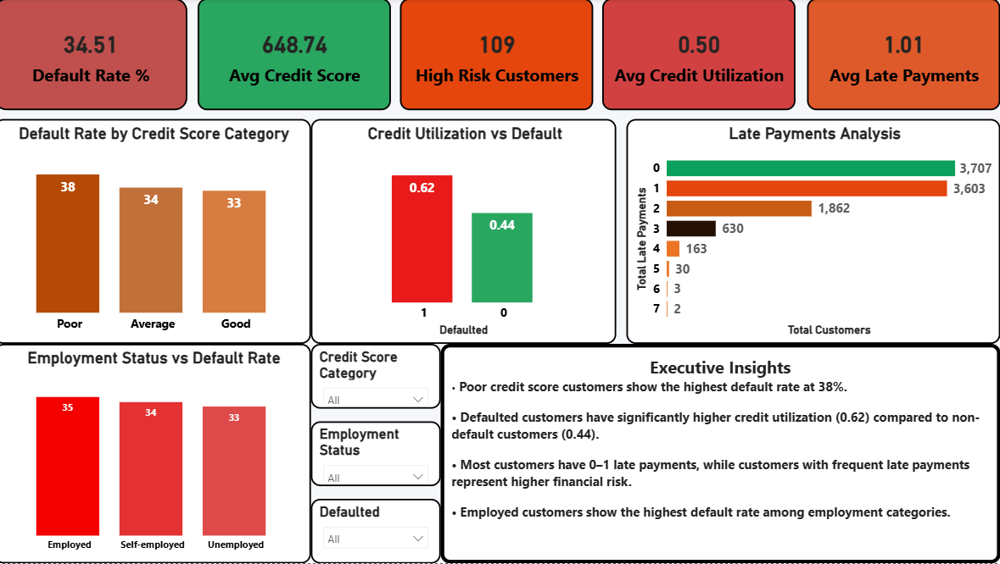
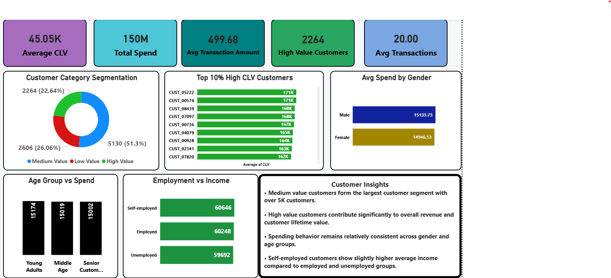
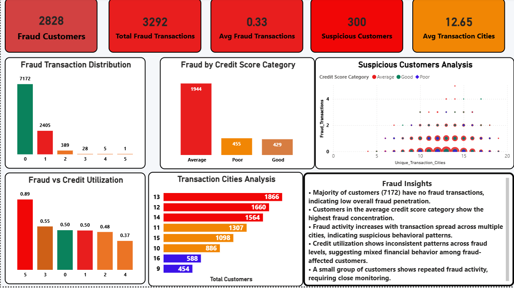

# 💳 Credit Risk Analytics Dashboard

## 📊 Project Overview
An end-to-end **Credit Risk Analytics Solution** built using **Python, SQL, and Power BI**.

This project analyzes customer financial behavior to:
- Identify high-risk customers
- Detect fraud patterns
- Segment customers by value
- Understand repayment behavior
- Support data-driven credit decisions

---

## 🧠 Business Problem
Credit card companies deal with large-scale financial data, making it difficult to:
- Predict customer default risk
- Detect fraudulent behavior
- Identify high-value customers
- Improve customer retention strategies

This project solves these problems using data analytics and visualization.

---

## 📁 Dataset Information

This project uses a publicly available credit card customer dataset for credit risk and behavioral analysis.

It includes 10,000 customer records with features such as:
- Credit Score
- Annual Income
- Transaction Behavior
- Fraud Transactions
- Default Status
- Demographic Information

### 📊 Dataset Source
🔗 Kaggle Dataset: https://www.kaggle.com/datasets/aadarshvani/credit-card-dataset-comprehensive

---

## 🛠️ Tools & Technologies
- Python (Pandas, NumPy, SciPy)
- SQL (MySQL Views, Aggregations, Segmentation)
- Power BI (Interactive Dashboard)
- Excel (Data validation)

---

## 📊 Key KPIs
- Total Customers: 10,000  
- Total Income: 603M  
- Total Spend: 150M  
- Average Credit Score: 648.74  
- Default Rate: 34.51%  
- Average CLV: 49,968  
- Fraud Customers: 2,828  
- Average Transactions: 20  

---

## 🔍 Key Insights

- Customers with **credit score < 600** show highest default risk (~38%).
- High credit utilization (>0.7) strongly increases default probability.
- Customers with frequent late payments are highly likely to default.
- Fraud activity is concentrated in a small customer group.
- High CLV customers contribute significantly to revenue.

---

## 📊 Dashboard Overview

### 1️⃣ Executive Summary
- KPIs overview
- Default distribution
- Credit score impact

### 2️⃣ Risk Analysis
- Credit score vs default
- Credit utilization vs default
- Late payment behavior

### 3️⃣ Customer Segmentation
- Low / Medium / High value customers
- CLV distribution
- Spending patterns

### 4️⃣ Fraud Analysis
- Fraud transaction distribution
- Suspicious customers
- Transaction city behavior

---

## 💡 Business Impact

- Helps reduce credit default risk
- Improves fraud detection system
- Enables targeted customer marketing
- Identifies high-value customers for retention

---

## 🚀 Recommendations

- Tighten credit approval for low credit score customers
- Monitor high credit utilization customers
- Investigate multi-city transaction patterns
- Focus retention strategy on high CLV customers

---

## 📸 Dashboard Preview

  
  
  

---

## 👨‍💻 Author
**Vishal Chauhan**  
Data Analyst | SQL | Python | Power BI  

GitHub: https://github.com/vishaldataanalyst
